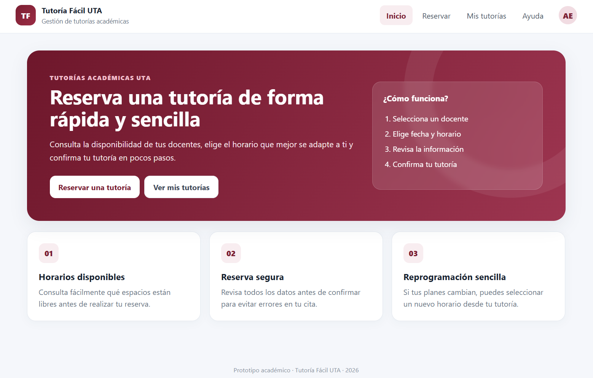
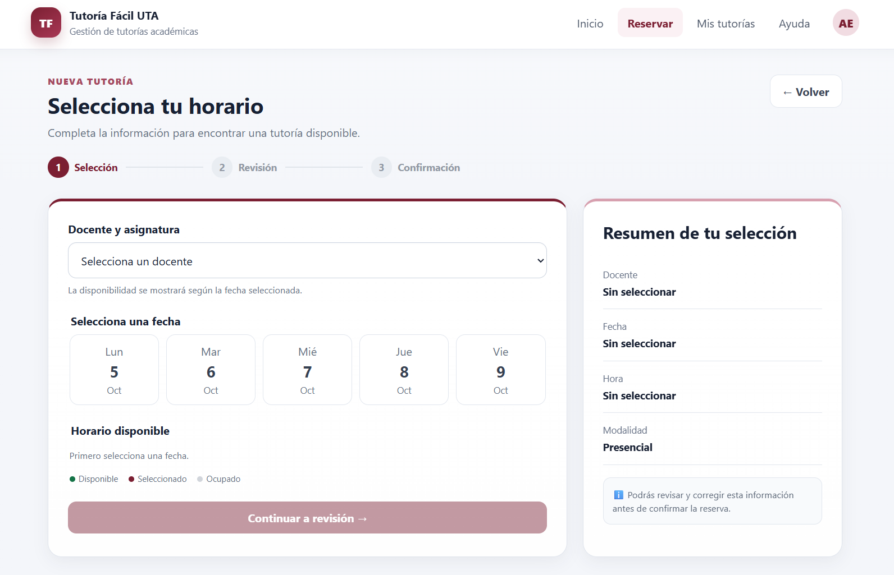
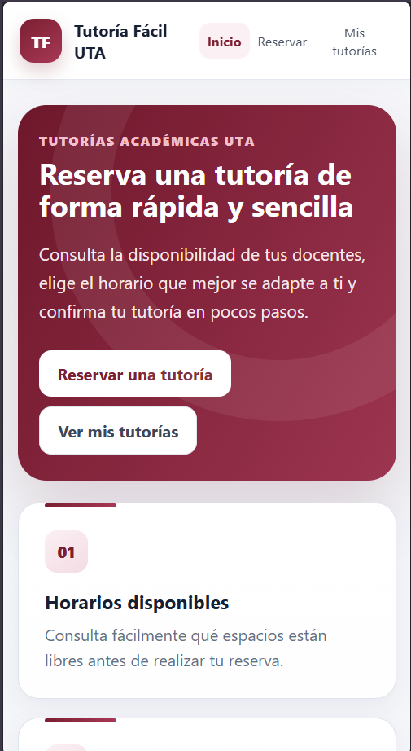
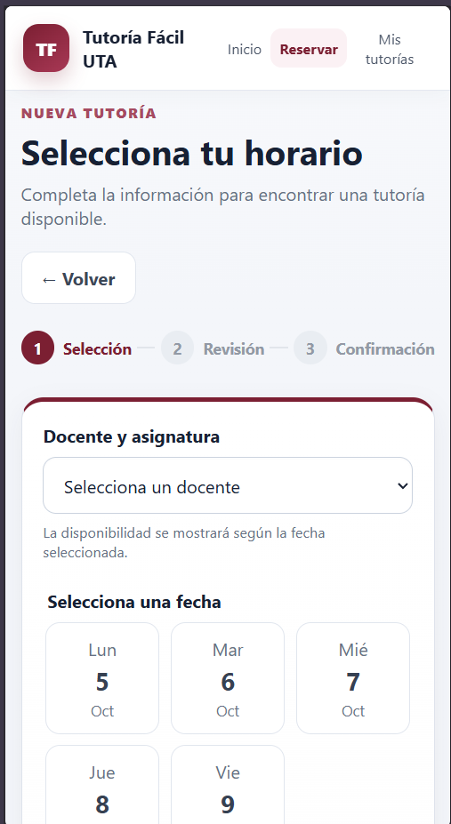
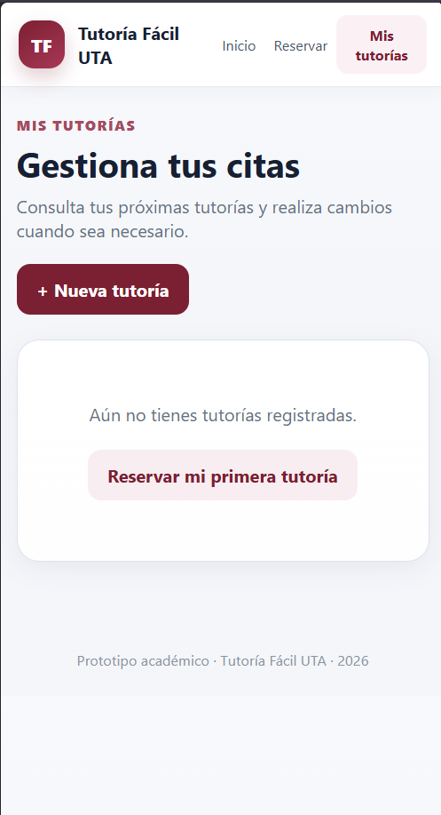

# Prueba cruzada e iteración

## 1. Objetivo de la prueba

Evaluar si un usuario externo al equipo puede completar el flujo principal
del prototipo Tutoría Fácil UTA sin asistencia, identificando posibles
errores, dudas u oportunidades de mejora.

## 2. Tarea evaluada

Se solicitó al participante realizar la siguiente tarea:

> Reservar una tutoría para el jueves y luego cambiar el horario.

## 3. Participante

La prueba fue realizada por una persona perteneciente a otro equipo.

## 4. Resultados

- Completó la tarea: Sí.
- Tiempo empleado: 55 segundos.
- Necesitó ayuda: No.
- Errores observados: Ninguno.
- Dudas observadas: Ninguna.
- Facilidad de uso observada: El participante encontró fácilmente las
  acciones necesarias para completar la tarea.

## 5. Comentario del participante

El participante indicó que la interfaz le parecía visualmente muy simple.

## 6. Hallazgo

El flujo resultó comprensible para el participante, quien logró completar
la tarea en 55 segundos, sin ayuda y sin presentar errores o dudas.

El principal hallazgo obtenido no estuvo relacionado con la navegación
o con la comprensión del flujo, sino con la presentación visual de la
interfaz, que fue percibida como demasiado simple.

## 7. Decisión de diseño

Debido a que el participante completó correctamente la tarea, se decidió
mantener el flujo, las etiquetas y la ubicación de las acciones principales.

No se modificó la estructura de navegación porque durante la prueba no se
observaron dificultades relacionadas con estos elementos.

La iteración se concentró en responder al comentario relacionado con la
simplicidad visual.

## 8. Mejora aplicada

Se realizó una iteración enfocada en reforzar la presentación visual del
prototipo.

Entre los cambios aplicados se encuentran:

- Mayor jerarquía visual en la pantalla principal.
- Uso más consistente de la identidad cromática.
- Mayor diferenciación visual entre tarjetas y secciones.
- Incorporación de sombras y profundidad.
- Mejora del espaciado entre componentes.
- Mayor diferenciación de las acciones principales.
- Presentación visual más elaborada sin alterar el flujo validado.

## 9. Comparación antes y después

### Antes de la iteración

La versión utilizada durante la prueba mantenía un diseño funcional y
comprensible, pero el participante consideró que su presentación visual
era demasiado simple.

### Después de la iteración

La nueva versión conserva el mismo flujo de reserva y reprogramación,
pero refuerza la jerarquía y presentación visual de sus componentes.

## 10. Conclusión

La prueba permitió comprobar que el flujo principal podía completarse
sin asistencia y sin errores observables. A partir del comentario recibido,
la iteración se orientó a mejorar la presentación visual sin modificar
los elementos de interacción que habían demostrado ser comprensibles.